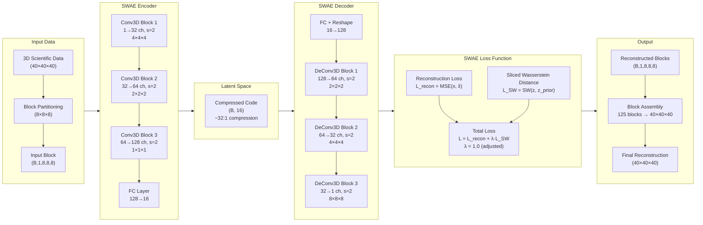
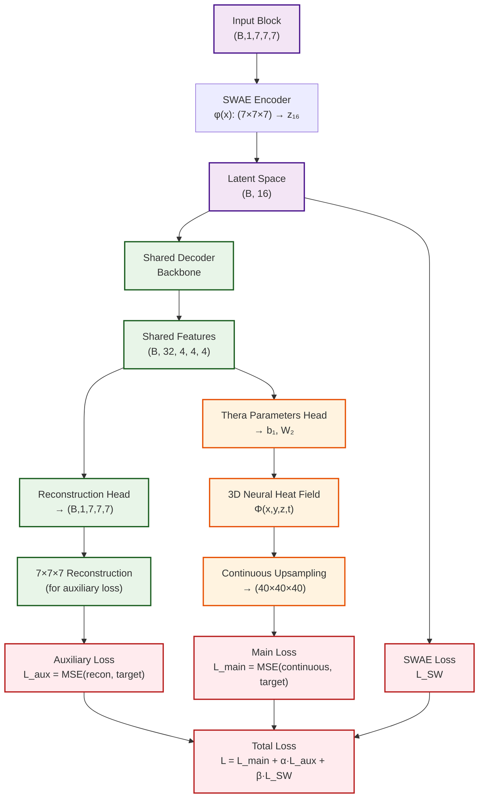

# Neural Network-Based Compression for Scientific Data

A deep learning compression system implementing **Sliced-Wasserstein Autoencoders (SWAE)** for 3D scientific data reconstruction, with plans for continuous upsampling using **Thera Neural Heat Fields**.

## Overview

This project implements a neural network-based compression system specifically designed for 3D scientific simulation data. We have successfully implemented a **pure SWAE (Sliced-Wasserstein Autoencoder)** architecture for reconstructing 3D mathematical functions of the form `sin(2πk₁x)sin(2πk₂y)sin(2πk₃z)` with high fidelity compression.

**Current Focus**: Adapting the SWAE architecture for **U_CHI variable data** from GR (General Relativity) simulation datasets, with ongoing improvements to address reconstruction quality issues.

## Current Implementation: SWAE 3D Architecture

We have implemented a complete SWAE system based on the paper *"Exploring Autoencoder-based Error-bounded Compression for Scientific Data"* with the following architecture:



### Key Features

- **Pure SWAE Implementation**: Block-wise processing of 3D data (8×8×8 blocks)
- **Sliced Wasserstein Distance**: O(n log n) complexity with 50 random projections
- **High Compression Ratio**: ~32:1 compression (512 → 16 dimensions)
- **Mathematical Function Reconstruction**: Specialized for `sin(2πk₁x)sin(2πk₂y)sin(2πk₃z)` functions
- **Proven Architecture**: Based on established research with [32, 64, 128] channel configuration

## U_CHI Dataset Implementation

### Dataset Characteristics
- **Source**: GR simulation HDF5 files containing U_CHI variable data
- **Block Size**: 7×7×7 (adapted from original 8×8×8)
- **Data Shape**: (num_samples, 1, 7, 7, 7)
- **Value Range**: Normalized between 0 and 1
- **Variability**: High dynamic range with significant spatial variations

### Current Issues Identified
1. **Poor Reconstruction Quality**: PSNR remains low (~3-6 dB) despite low MSE
2. **Data Variability**: Unnecessary complexity in the data distribution
3. **Architectural Mismatch**: 7×7×7 input with 8×8×8 decoder output requiring cropping
4. **Regularization Impact**: High lambda_reg (10.0) was causing over-regularization

### Recent Improvements
- **Reduced Regularization**: λ_reg adjusted from 10.0 to 1.0
- **Enhanced Monitoring**: Added latent space range and correlation tracking
- **Improved Inference**: VTI file generation and detailed slice comparisons
- **Batch Size Optimization**: Increased to 64 for better training stability

## Current Results

### Mathematical Function Results (128×128×128 Resolution)
- **Original data range**: [-0.999771, 0.999771]
- **Reconstructed data range**: [-1.257744, 1.342528]
- **Mean Squared Error (MSE)**: 0.00684822
- **Mean Absolute Error (MAE)**: 0.06383123
- **Peak Signal-to-Noise Ratio (PSNR)**: 21.64 dB
- **Structural Similarity (correlation)**: 0.972412

### U_CHI Dataset Results (Current Training)
- **Training Status**: Ongoing with 130+ epochs
- **Validation PSNR**: ~3-6 dB (needs improvement)
- **MSE**: Low but reconstruction quality poor
- **Issue**: Model is learning compressed representation but failing at reconstruction

## Proposed Improvements

### 1. Log-Scale Processing
**Problem**: High data variability causing reconstruction difficulties
**Solution**: Apply log-scale transformation to reduce dynamic range

```python
# Proposed preprocessing
def log_scale_transform(data, epsilon=1e-8):
    """Apply log-scale transformation to reduce dynamic range"""
    return torch.log(data + epsilon)

def inverse_log_scale_transform(log_data, epsilon=1e-8):
    """Inverse log-scale transformation"""
    return torch.exp(log_data) - epsilon
```

### 2. Thera Integration
**Problem**: Block-based reconstruction with assembly artifacts
**Solution**: Integrate Thera Neural Heat Fields for continuous reconstruction

### Planned SWAE + Thera Architecture



### Thera Benefits
- **Continuous Reconstruction**: No block assembly artifacts
- **Anti-aliasing Guarantees**: Theoretically grounded upsampling
- **Multi-scale Capability**: Single model for multiple resolutions
- **Thermal Activation**: `ξ(z,ν,κ,t) = sin(z)·exp(-|ν|²κt)` for frequency control

### 3. Architectural Refinements
- **Consistent Block Sizes**: Align encoder/decoder for 7×7×7 throughout
- **Improved Loss Functions**: Consider perceptual losses or SSIM
- **Data Augmentation**: Rotation, scaling for better generalization

## Data Format

The system currently works with:
- **3D Mathematical Functions**: `sin(2πk₁x)sin(2πk₂y)sin(2πk₃z)` with k ∈ {2,3,4,5,6}
- **U_CHI GR Data**: 7×7×7 blocks from HDF5 simulation files
- **Volume Size**: 40×40×40 → 128×128×128 (validation)
- **Block Processing**: 7×7×7 blocks (adapted from 8×8×8)
- **Output Format**: VTI files for scientific visualization

## Future Goals

1. **Log-Scale Implementation**: Reduce data variability for better reconstruction
2. **Thera Integration**: Continuous reconstruction without block artifacts
3. **Multi-scale Evaluation**: Test reconstruction at various resolutions
4. **Performance Optimization**: Improve compression ratios and reconstruction quality
5. **GR Dataset Optimization**: Fine-tune for U_CHI variable characteristics

## Project Structure

```
├── models/
│   ├── swae_pure_3d.py          # Pure SWAE 3D implementation
│   ├── swae_pure_3d_7x7x7.py    # 7×7×7 adapted SWAE
│   ├── swae.py                  # SWAE with LIIF integration
│   ├── thera_3d.py              # 3D Thera neural heat fields
│   └── liif_3d.py               # 3D LIIF framework
├── datasets/
│   ├── math_function_3d.py      # 3D mathematical function dataset
│   ├── u_chi_dataset.py         # U_CHI GR dataset implementation
│   └── swae_3d_dataset.py       # SWAE-specific dataset wrapper
├── configs/
│   └── train-3d/               # Training configurations
├── validation_128_inference_results/  # 128³ validation results
├── validation_inference_results/      # 40³ validation results
├── validation_u_chi_results_*/        # U_CHI validation results
├── train_swae_3d_pure.py        # Pure SWAE training script
├── train_swae_u_chi.py          # U_CHI dataset training
└── inference_swae_u_chi_validation.py  # U_CHI validation inference
```

## Installation

```bash
# Clone the repository
git clone https://github.com/tahmidawal/NN-based-Compression-for-Scientific-Data.git
cd NN-based-Compression-for-Scientific-Data

# Install dependencies
pip install torch torchvision torchaudio
pip install vtk matplotlib numpy pyyaml h5py
```

## Usage

### Training SWAE Model (Mathematical Functions)

```bash
python train_swae_3d_pure.py --config configs/train-3d/train_swae_thera_3d.yaml
```

### Training SWAE Model (U_CHI Dataset)

```bash
python train_swae_u_chi.py --config configs/train-3d/train_swae_thera_3d.yaml
```

### Running Inference

```bash
python inference_swae_3d_128_validation.py --model_path save/swae_3d_model.pth
python inference_swae_u_chi_validation.py --model_path save/swae_u_chi_model.pth
```

## Current Status

- ✅ **Mathematical Function SWAE**: Fully implemented and working
- ✅ **U_CHI Dataset**: Implemented and training
- 🔄 **Reconstruction Quality**: Needs improvement (log-scale + Thera)
- 🔄 **Thera Integration**: Planned for continuous reconstruction
- 🔄 **Log-Scale Processing**: Proposed for data variability reduction

## Technical Specifications

- **Framework**: PyTorch
- **Input Resolution**: 40×40×40 → 128×128×128
- **Block Size**: 8×8×8 (as per SWAE paper Table VI)
- **Latent Dimension**: 16
- **Architecture Channels**: [32, 64, 128]
- **Compression Ratio**: ~32:1
- **Loss Components**: Reconstruction + Sliced Wasserstein (λ=10.0)

## Research Foundation

This implementation is based on:
1. **"Exploring Autoencoder-based Error-bounded Compression for Scientific Data"** - SWAE architecture
2. **"Thera: Aliasing-Free Arbitrary-Scale Super-Resolution with Neural Heat Fields"** - Continuous upsampling (planned)
3. **"Learning Continuous Image Representation with Local Implicit Image Function"** - LIIF framework integration

## Contributing

This is an active research project. Contributions and suggestions for improving 3D scientific data compression are welcome!

## License

[Add your license here]

---

**Status**: ✅ SWAE Implementation Complete | 🚧 Thera Integration In Progress | 📋 GR Dataset Testing Planned
